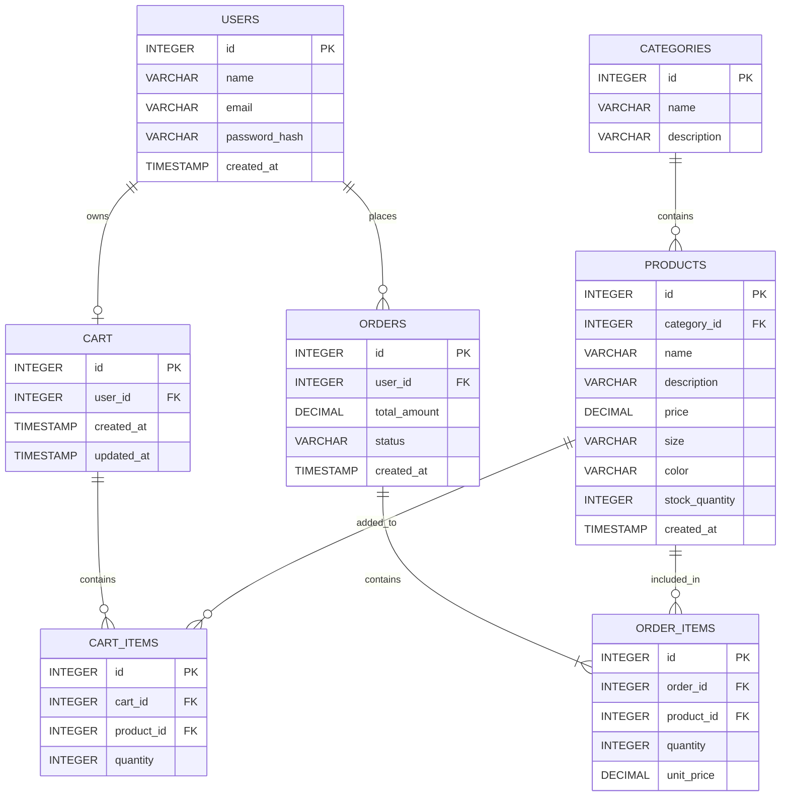

# E-Commerce Clothing Store — Sprint 1
## Architecture & Scope Definition

**Project:** Online Clothing Store  
**Sprint:** 1 — Planning  
**Document:** Architecture & Scope Definition

---

## 1. Target Audience & Market Focus

### Primary Persona

The primary users of this e-commerce website are **retail customers who want to purchase clothing and fashion products online**.

A typical user may be a student, young professional, or general customer who wants to browse clothing collections, check product details such as size, color, and price, add items to a shopping cart, and place an order online.

### Core Pain Point

Customers may find it inconvenient to visit physical clothing stores, compare different products, and check available sizes and prices. The proposed system provides a convenient online platform where customers can browse clothing products, search and filter items, select suitable sizes and colors, manage their cart, and place orders.

The system also provides an administrator with basic functionality to manage clothing products, categories, prices, stock, and inventory.

### Domain Scope

The project focuses on the **Clothing and Fashion E-Commerce** domain.

The initial system will cover:

- Customer registration and authentication
- Clothing product browsing and searching
- Clothing categories
- Product details including size, color, price, and stock
- Shopping cart management
- Order processing and checkout
- Basic product and inventory management

The scope is intentionally limited to the core functionality required for a semester-level MVP.

---

## 2. MVP Feature Scope

The Minimum Viable Product (MVP) contains the primary workflows required for a functional online clothing store.

| Category | Feature | Description | Priority |
|---|---|---|---|
| Authentication | User Registration & Authentication | Allows customers to create an account and securely log in. Passwords will be stored using hashing and JWT-based authentication will be used for authenticated requests. | High (MVP) |
| Catalog | Clothing Product List & Search | Allows customers to browse clothing products and search/filter them by category, size, color, and other basic product information. | High (MVP) |
| Product | Product Details | Displays clothing information such as product name, description, price, available sizes, colors, and stock quantity. | High (MVP) |
| Cart | Cart Management | Allows customers to add clothing items to the cart, change quantities, select product variants, and remove items. | High (MVP) |
| Checkout | Order Processing | Allows customers to confirm cart contents and create an order. A mock payment or Stripe integration may be used. | High (MVP) |
| Admin | Inventory Control | Allows the administrator to add, update, delete, and manage clothing products, categories, prices, and inventory. | Medium |

### MVP Scope Boundary

The main customer workflow is:

**Register/Login → Browse Clothing → Search/Filter → View Product → Add to Cart → Checkout → Create Order**

The first version will focus on essential online shopping functionality. Advanced features such as AI-based fashion recommendations, loyalty programs, seller accounts, advanced analytics, and complex delivery tracking are outside the Sprint 1 MVP scope.

---

## 3. Tech Stack Selection & Justification

### Frontend Framework: React.js

**React.js** will be used for the frontend of the clothing e-commerce website. React provides a component-based architecture that supports reusable components for product cards, category pages, product details, cart, checkout, and admin screens. It was selected because it is suitable for interactive e-commerce interfaces and has a large ecosystem compared with building the interface only with traditional HTML, CSS, and JavaScript.

### Backend Infrastructure: Node.js with Express.js

**Node.js with Express.js** will be used to develop the backend REST API. Node.js provides an efficient environment for handling web requests, while Express.js provides a lightweight structure for creating APIs for users, products, carts, and orders. Using JavaScript on both frontend and backend also makes integration easier.

### Database Management System: PostgreSQL

**PostgreSQL** will be used as the database management system. A clothing store contains structured relationships between customers, products, categories, carts, orders, and order items, so a relational database is suitable. PostgreSQL provides primary keys, foreign keys, constraints, transactions, and strong data integrity for this type of structured e-commerce data.

### Caching & Asynchronous Processing: Redis (Optional)

**Redis** may be introduced later for caching frequently accessed product or category data and temporary session-related information. It can improve performance when the number of users increases. Redis is optional for the MVP and will only be used if caching or background processing becomes necessary.

### Selected Architecture

The planned application follows a basic client-server architecture:

**React Frontend → Express/Node.js REST API → PostgreSQL Database**

Redis can optionally be added as a caching layer when required.

---

## 4. Entity-Relationship Diagram (ERD)

The database contains the following main entities:

- **Users** — stores customer account information.
- **Categories** — stores clothing categories such as Men, Women, Kids, and Accessories.
- **Products** — stores clothing product details, price, size, color, and stock.
- **Orders** — stores customer orders.
- **Order_Items** — connects orders with products and stores quantity and purchase price.
- **Cart** — stores the customer's active shopping cart.
- **Cart_Items** — connects carts with products and stores selected quantities.

### Mermaid ERD

### Relationship & Cardinality

| Relationship | Cardinality | Explanation |
|---|---|---|
| Users → Orders | 1:N | One customer can place many orders, while each order belongs to one customer. |
| Users → Cart | 1:1 | One customer has one active cart, and each cart belongs to one customer. |
| Categories → Products | 1:N | One clothing category can contain many products, while each product belongs to a category. |
| Cart → Cart_Items | 1:N | One cart can contain multiple cart items. |
| Products → Cart_Items | 1:N | A clothing product can appear in cart items belonging to different carts. |
| Orders → Order_Items | 1:N | One order contains one or more order items. |
| Products → Order_Items | 1:N | A clothing product can occur in multiple order items across different orders. |
| Orders ↔ Products | N:M | An order can contain many products and a product can appear in many orders; `ORDER_ITEMS` resolves this relationship. |
| Cart ↔ Products | N:M | A cart can contain many products and a product can appear in many carts; `CART_ITEMS` resolves this relationship. |

### Primary Keys and Foreign Keys

- `USERS.id` is the **Primary Key** of the Users table.
- `CATEGORIES.id` is the **Primary Key** of the Categories table.
- `PRODUCTS.id` is the **Primary Key** of the Products table.
- `ORDERS.id` is the **Primary Key** of the Orders table.
- `ORDER_ITEMS.id` is the **Primary Key** of the Order_Items table.
- `CART.id` is the **Primary Key** of the Cart table.
- `CART_ITEMS.id` is the **Primary Key** of the Cart_Items table.
- `PRODUCTS.category_id` is a **Foreign Key** referencing `CATEGORIES.id`.
- `ORDERS.user_id` is a **Foreign Key** referencing `USERS.id`.
- `ORDER_ITEMS.order_id` is a **Foreign Key** referencing `ORDERS.id`.
- `ORDER_ITEMS.product_id` is a **Foreign Key** referencing `PRODUCTS.id`.
- `CART.user_id` is a **Foreign Key** referencing `USERS.id`.
- `CART_ITEMS.cart_id` is a **Foreign Key** referencing `CART.id`.
- `CART_ITEMS.product_id` is a **Foreign Key** referencing `PRODUCTS.id`.

---

## Sprint 1 Conclusion

Sprint 1 establishes the baseline architecture, functional scope, technology choices, and relational data model for the online clothing store.

The proposed MVP is intentionally limited to authentication, clothing catalog browsing and search, product details, cart management, checkout/order processing, and basic inventory control. The relational ERD provides the database foundation required to implement these workflows in later sprints.

The architecture can be extended in future sprints as additional requirements are introduced, while the current scope remains feasible for an academic semester project.
